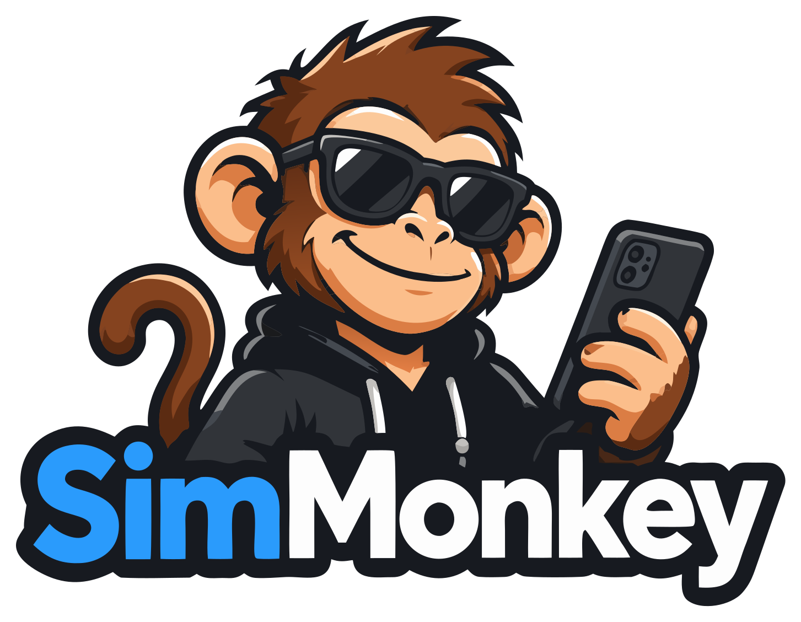

<p align="center">
  
</p>

<p align="center">
  Stub, break, slow down and inspect your iOS app's network traffic — from a panel beside the simulator, with no rebuild and no relaunch.
</p>

---

**SimMonkeyKit** is the client half of SimMonkey: a debug-only Swift package you add to your app with one line. It routes every `URLSession` request through the SimMonkey panel running on your Mac, which decides whether the request goes to the real server, gets a canned response, fails, or waits.

## Why

The moment you need to see how your app behaves when the backend misbehaves, your options get worse fast.

- **A mock repository** covers the happy path and one or two error cases you thought of in advance. It needs a rebuild for every new scenario, and it never exercises the real networking code.
- **A proxy like Charles or Proxyman** sees everything, but only after you've installed a root certificate in the simulator, pointed the simulator at the proxy, and remembered to do both again after every simulator reset. Breakpoints pause the whole flow while you type.
- **Asking the backend team** for a broken endpoint on staging is a ticket, a wait, and then someone else's fix breaks your test.

SimMonkey sits in the app's own network stack, so there is nothing to install in the simulator and nothing to configure per scheme. You write a rule in the panel — *this URL, with this body, returns 500 after three seconds* — and the next request the app makes gets exactly that. Change the rule and the next request gets the new one. The app never restarts.

What that buys you in practice:

- **Error and loading states you can actually see.** A real `NSURLErrorNotConnectedToInternet` delivered to your real error path — not a mocked-out success. A 3000 ms delay that holds your skeleton screen long enough to look at it.
- **Payloads the backend will never send you on purpose.** Empty lists, missing fields, an enum value that doesn't exist yet, a 434 KB response, a body in the wrong encoding.
- **Rules that understand your API.** Match on the request body as well as the URL, so a WCF-style service that serves every operation from one endpoint can be stubbed one operation at a time.
- **Rerouting without a rebuild.** Forward a whole path to staging with a test token injected, and leave everything else alone.
- **A full record of what actually went over the wire.** Headers, cookies, both bodies — including the `Cookie` header `URLSession` adds below the level your code can see.
- **Edit & Send.** Take any captured request, change it, fire it, read the response.

And when the panel isn't running, none of it exists. Every request passes straight through, exactly as it would without the package.

## Requirements

- iOS 15+ (the package also compiles for macOS 12+ and tvOS 15+)
- The SimMonkey panel running on the same Mac, listening on `127.0.0.1:8377`
- The iOS Simulator — the panel is reached over loopback, so a physical device won't find it

## Install

Add the package to your app target. As a local package, from a checkout next to your project:

> **File → Add Package Dependencies… → Add Local…** and pick the `SimMonkeyKit` folder.

Or as a Git dependency if you host it. Either way, link the `SimMonkeyKit` library to your **app** target only.

Don't copy the source files into your project. The package changes; a copy silently doesn't. Every "the panel shows nothing for this request" so far has been a stale copy.

## Usage

Two lines, in your `App` (or `AppDelegate`) initialiser, before anything makes a network request:

```swift
import SimMonkeyKit

@main
struct MyApp: App {
    init() {
        #if DEBUG
        SimMonkey.start()
        #endif
    }
    var body: some Scene { … }
}
```

That's the whole integration. On launch you'll see this in the console before your own logs:

```
[simmonkey] 1.0.0 attached — panel at 127.0.0.1:8377
```

The version is there on purpose. If yours has no version number, you're on a pre-1.0 copy — see [CHANGELOG.md](CHANGELOG.md) for everything it's missing.

If the panel listens somewhere else:

```swift
SimMonkey.start(port: 8400)
```

**Keep the `#if DEBUG`.** The package swizzles `URLSessionConfiguration` for the whole process; it has no business in a release build, and the guard is what keeps it out.

### Order matters

`start()` has to run **before the first `URLSession` is created** — not before the first request, before the session. A session snapshots its configuration when it's made, and one made earlier won't carry the interceptor.

`URLSession.shared` is created lazily, so it's fine as long as nothing touches it first. But if you use **Alamofire**, a custom `Session`, or any static session, make sure `start()` runs before that object is first accessed. In a SwiftUI `App`, `init()` is early enough; in a UIKit app, the top of `application(_:didFinishLaunchingWithOptions:)` is.

The symptom of getting this wrong is subtle: *some* traffic appears in the panel (from `URLSession.shared`) and the rest never does.

## How it works

`start()` does three things:

1. Builds a private "passthrough" `URLSession` **before** touching anything else, so its configuration can never contain the interceptor. This is how forwarded requests avoid re-entering it.
2. Swizzles the `protocolClasses` getter on `URLSessionConfiguration` so every session created from then on lists `SimMonkeyURLProtocol` first. (`URLProtocol.registerClass` alone does nothing for `URLSession`; a session reads its protocol list off the configuration.)
3. Registers the protocol.

From then on, each request the app makes is POSTed to the panel as `/resolve`. The panel matches it against its rules and answers with one of:

| action | the app gets |
|---|---|
| `passthrough` | the real server's response, relayed as it streams |
| `stub` | the status, headers and body from the rule, after any delay |
| `fail` | a real `NSURLError` with the rule's code, after any delay |
| `forward` | the real server's response, but with the request's URL and headers rewritten first |

Passthrough and forward responses are relayed **as they arrive**, not buffered — a radio stream or an SSE endpoint plays instead of hanging. Once a response finishes, `/report` sends the panel its status, timing, headers and up to 512 KB of body for the Traffic list.

Matching runs off the main actor behind a lock, so the app's request is never blocked waiting on a busy UI.

## What it can and can't see

Anything that goes through `URLSession` or `CFNetwork`. That includes `URLSession.shared`, custom sessions, Alamofire, `AsyncImage`, and — this surprised us — progressive `AVPlayer` streams like an MP3 radio URL, which show up as `206`s and relay normally.

It does not see:

- **`WKWebView` content.** Separate process; never loads the package.
- **`Network.framework` (`NWConnection`) and raw sockets.**
- **HLS and anything the system loads out of process.**
- **Release builds**, assuming you kept the `#if DEBUG`.

You can't usefully *stub* a media stream — a stubbed body arrives in one chunk, which isn't what a player wants from an endless response. Stub the metadata and playlist calls around it instead.

## Guarantees

**It fails open, always.** Panel not running, port refused, panel crashed mid-session, garbage reply — every failure inside the bridge resolves to "pass the request through untouched". A stopped tool must never look like a broken app. After a refused connection the client stops dialling for three seconds rather than opening a doomed socket per request, so a burst of twenty requests costs one failed connect instead of twenty console lines.

**It keeps your session.** Forwarded requests share `HTTPCookieStorage.shared` with the app, so a cookie established at login — before the interceptor was involved, or through another session — still goes out. (An earlier version used an isolated cookie jar and quietly 401'd every authenticated call. That's the sort of thing this list exists to prevent regressing.)

**It needs no permissions.** Nothing in the simulator, nothing in the app's entitlements, no TCC prompt on the Mac.

**Cancellation is honoured.** Cancel a request during an injected delay and nothing is delivered afterwards.

## Troubleshooting

**Nothing appears in the panel.** The panel isn't running, isn't on 8377, or `start()` ran after your session was created (see *Order matters*). Check the console for the `attached` line first.

**Traffic appears but the response body is empty.** Almost always a stale copy of the package that predates body capture. Check the attach line for a version number; reference the package, don't copy it.

**Some requests appear, others don't.** A session created before `start()`. Move the call earlier.

**Requests get slow when the panel is closed.** They shouldn't — a refused connection is detected in a few milliseconds. If they do, you're on a version older than the fix; update.

**Curly quotes in a stub body.** macOS substitutes `"` for `"` as you type in most text fields. The panel's editor turns that off, and *Format JSON* repairs a body that was already saved that way.

## Wire protocol

Kept deliberately stable so a test harness can install fixtures over HTTP without the panel. Both endpoints are `POST` with a JSON body to `127.0.0.1:8377`.

`/resolve` — sent before the request goes out:

```json
{"method":"POST","url":"https://…","headers":{"Cookie":"…"},"body":"<base64>"}
```

answers with one of:

```json
{"traceId":"…","action":"passthrough"}
{"traceId":"…","action":"stub","status":200,"headers":{},"body":"<base64>","delayMs":0}
{"traceId":"…","action":"fail","failCode":-1009,"delayMs":0}
{"traceId":"…","action":"forward","url":"https://…","headers":{},"delayMs":0}
```

`/report` — sent when a passthrough or forward finishes (and once earlier, when its headers land):

```json
{"traceId":"…","status":200,"ms":353,"bytes":434307,"error":"","seq":2,
 "responseHeaders":{},"responseBody":"<base64>","responseBodyTruncated":false}
```

Every field beyond `action` is optional and additive; a client that doesn't recognise an action treats it as `passthrough`.
